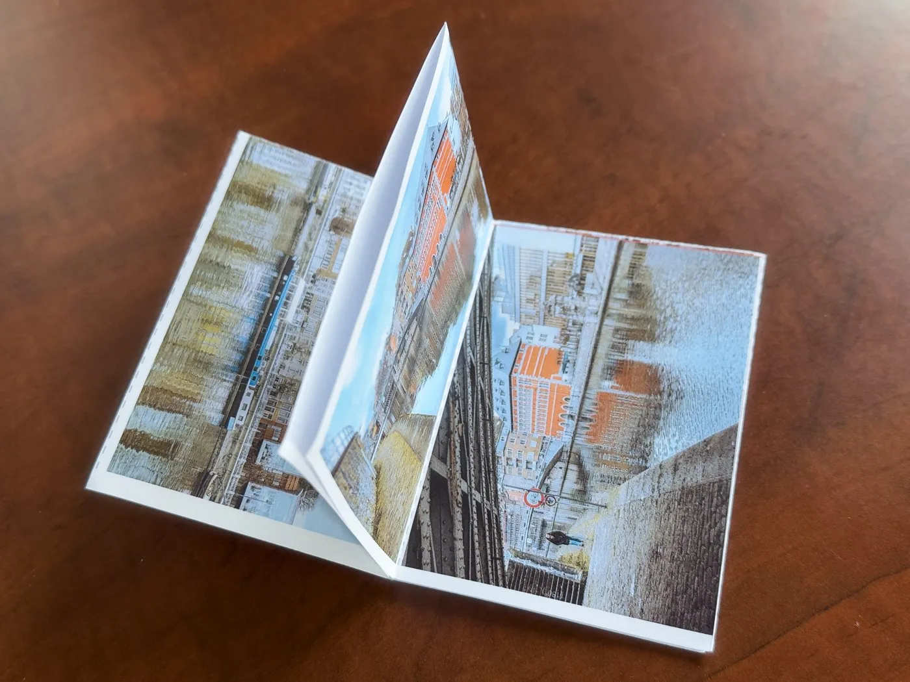
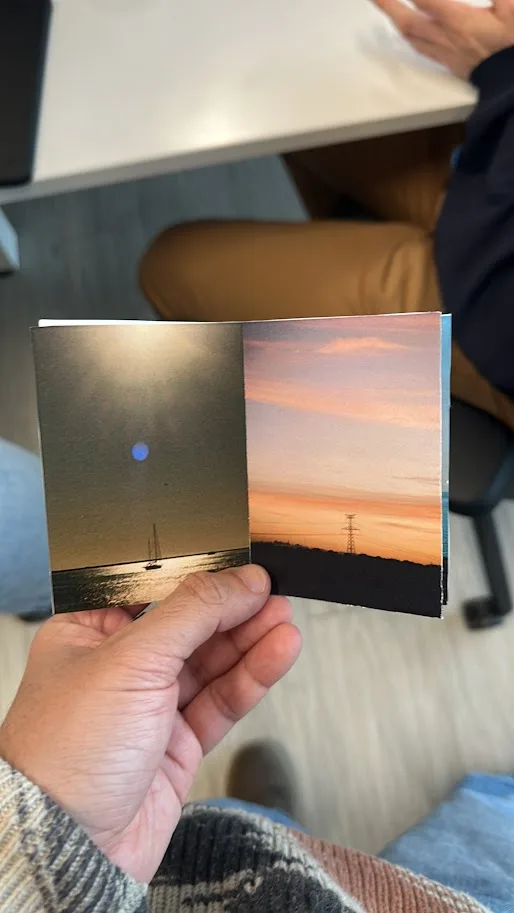
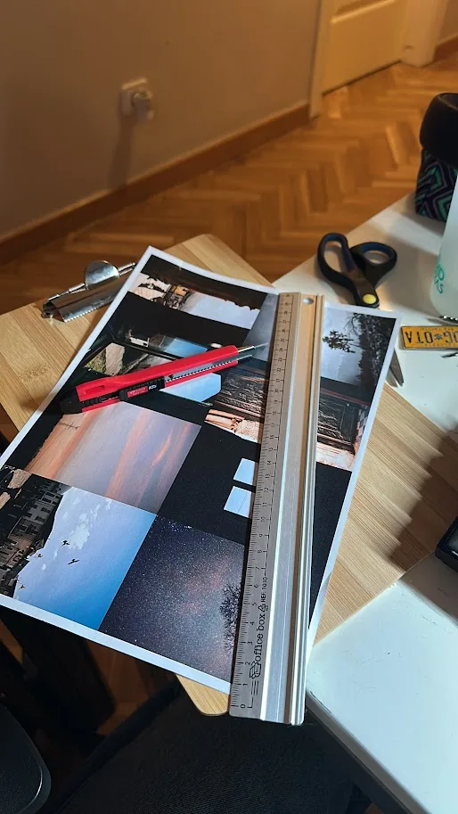
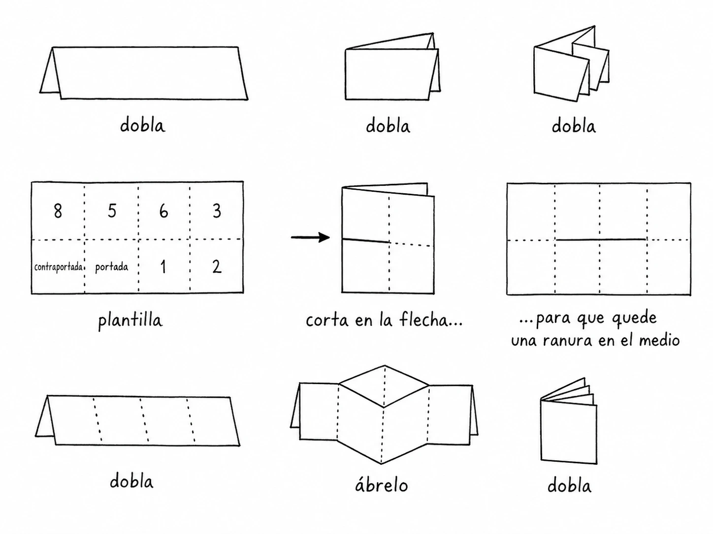

# Fanzines

[](https://nuxt.com)
[](https://vuejs.org)
[](https://nodejs.org)
[](https://workers.cloudflare.com)
[](#licencia)

> Editor en el navegador para crear, imprimir y exportar fanzines A4 plegables.

Fanzines es una aplicación web para diseñar un fanzine de **ocho paneles** sobre una hoja **A4** plegable: colocas textos e imágenes en cada panel, revisas el pliego completo y exportas un **PDF listo para imprimir, cortar y doblar**. Todo ocurre en el navegador; no se sube nada a ningún servidor.

- **Web:** [fanzines.app](https://fanzines.app)
- **Editor:** [fanzines.app/editor](https://fanzines.app/editor)

## Capturas

<table>
  <tr>
    <td width="50%" align="center"><br><sub>Fanzine desplegado</sub></td>
    <td width="50%" align="center"><br><sub>Fanzine en la mano</sub></td>
  </tr>
  <tr>
    <td width="50%" align="center"><br><sub>Mesa de trabajo</sub></td>
    <td width="50%" align="center"><br><sub>Guía de plegado</sub></td>
  </tr>
</table>

## Características

- **Editor de 8 paneles con imposición A4.** Portada, contraportada y 6 páginas interiores, colocadas automáticamente en la rejilla de impresión (4 columnas × 2 filas) con las rotaciones correctas para el plegado.
- **Texto e imágenes.** Sube fotos (una a una o por lotes) **arrastrándolas al lienzo, a una miniatura de página o a la ventana**, o desde el botón de carga, y escribe directamente sobre el lienzo. Cada elemento se puede **mover, girar, escalar, ajustar opacidad, bloquear, reordenar (z-order) y alinear** dentro del panel.
- **Edición de texto en línea.** Haz clic en un cuadro de texto y escribe sobre el lienzo.
- **Carga por lotes con auto-optimización.** Al importar varias imágenes, se reparten entre las páginas disponibles y se reducen automáticamente si superan los 2400 px en el lado mayor.
- **Previsualización del pliego.** Revisa la hoja A4 completa con los 8 paneles antes de exportar.
- **Exportación PDF a 300 DPI.** El PDF sale impuesto para una hoja A4 horizontal, con **guías de corte y doblez** opcionales y **márgenes de seguridad**.
- **Guías de previsualización.** Activa/desactiva las guías del editor mientras diseñas.
- **Analítica opcional con PostHog.** Solo se activa si se define la clave de API; captura eventos de uso y errores, sin grabación de sesión.
- **SEO listo.** Sitemap, robots, metadatos Open Graph/Twitter y JSON-LD `WebApplication` mediante `@nuxtjs/seo`.
- **Accesible y responsive.** Skip link, foco visible, `prefers-reduced-motion` y diseño adaptado a móvil.

## Tecnologías

| Área | Herramienta |
| --- | --- |
| Framework | [Nuxt 4](https://nuxt.com) · [Vue 3](https://vuejs.org) |
| UI | [@nuxt/ui](https://ui.nuxt.com) v4 · [Tailwind CSS](https://tailwindcss.com) v4 · [Iconify (lucide)](https://iconify.design) |
| Lienzo / editor | [Konva](https://konvajs.org) · [vue-konva](https://github.com/konvajs/vue-konva) |
| Exportación PDF | [jsPDF](https://github.com/parallax/jsPDF) |
| Animaciones | [GSAP](https://gsap.com) + ScrollTrigger |
| Imágenes / fuentes | [@nuxt/image](https://image.nuxt.com) · [@nuxt/fonts](https://fonts.nuxt.com) |
| SEO | [@nuxtjs/seo](https://nuxtseo.com) |
| Scripts / analítica | [@nuxt/scripts](https://scripts.nuxt.com) · [PostHog](https://posthog.com) |
| Despliegue | [Cloudflare Workers](https://workers.cloudflare.com) · [Wrangler](https://developers.cloudflare.com/workers/wrangler/) |

## Requisitos

- **Node.js 26** (versión fijada en [`.nvmrc`](./.nvmrc)). Si usas `nvm`:

  ```bash
  nvm use
  ```

## Instalación y desarrollo

```bash
npm install
npm run dev
```

El servidor de desarrollo arranca en **http://localhost:3000**. El editor está en `/editor`.

### Variables de entorno

PostHog es **opcional**. Para activar la analítica, define la clave pública en el entorno (por ejemplo en `.env`):

```bash
NUXT_PUBLIC_SCRIPTS_POSTHOG_API_KEY=tu_clave_publica
```

Sin esta variable, la analítica permanece desactivada.

## Scripts

| Comando | Descripción |
| --- | --- |
| `npm run dev` | Servidor de desarrollo en `http://localhost:3000` |
| `npm run build` | Compila la app para producción (salida en `.output/`) |
| `npm run generate` | Genera el sitio estático |
| `npm run preview` | Previsualiza localmente el build de producción |
| `npm run analyze` | Analiza el bundle de la app sin servir |
| `npm run postinstall` | Prepara tipos de Nuxt (`nuxt prepare`, se ejecuta tras `npm install`) |

## Estructura del proyecto

```
fanzines/
├── app/
│   ├── app.vue                     # Raíz: UApp + JSON-LD WebApplication
│   ├── app.config.ts               # Tema @nuxt/ui (colores: lime / cyan / stone)
│   ├── assets/css/main.css         # Estilos globales y variables de marca
│   ├── components/zine/
│   │   ├── ZineEditor.client.vue   # Editor principal (cliente)
│   │   ├── PageCanvas.vue          # Lienzo Konva de un panel
│   │   ├── PageSelector.vue        # Navegación entre las 8 páginas
│   │   ├── ElementInspector.vue    # Panel de propiedades del elemento
│   │   ├── ExportPanel.vue         # Opciones y acción de exportar PDF
│   │   └── SheetPreview.vue        # Previsualización del pliego A4
│   ├── composables/
│   │   ├── useZineStore.ts                 # Estado del fanzine (useState)
│   │   ├── useZineImageImport.client.ts    # Importación de imágenes
│   │   ├── useZineDragState.client.ts      # Estado de arrastre
│   │   ├── useZineAnalytics.client.ts      # Eventos PostHog
│   │   └── useTrackedZinePageSelection.client.ts
│   ├── utils/
│   │   ├── zineLayout.ts            # Geometría A4 e imposición de paneles
│   │   ├── renderZine.client.ts     # Render de elementos a Konva
│   │   ├── renderSheet.client.ts    # Render del pliego completo a canvas
│   │   ├── exportPdf.client.ts      # Generación del PDF con jsPDF
│   │   └── zineImageCache.ts        # Caché de imágenes HTML
│   ├── types/zine.ts               # Tipos: PageId, ZineElement, ZineState…
│   ├── plugins/posthog-errors.client.ts
│   └── pages/
│       ├── index.vue               # Landing (hero + cómo se hace)
│       └── editor.vue              # Página del editor
├── public/
│   ├── favicon.ico · favicon.svg
│   ├── _robots.txt
│   └── images/                     # Fotos y guías (webp)
├── nuxt.config.ts                  # Módulos, SEO, fuentes, iconos, routeRules
├── wrangler.jsonc                  # Configuración de Cloudflare Workers
├── .nvmrc                          # Node 26
└── package.json
```

## Arquitectura

### Estado del fanzine

El estado vive en `useState<ZineState>` a través de [`useZineStore`](app/composables/useZineStore.ts). Contiene la página seleccionada, el elemento seleccionado, el mapa de elementos y el orden por página. Las imágenes se guardan como `blob:` URLs y se liberan (`URL.revokeObjectURL`) al eliminarlas o reiniciar.

### Geometría e imposición

[`zineLayout.ts`](app/utils/zineLayout.ts) define el formato A4 (297 × 210 mm) y el mapeo de las 8 páginas a una rejilla de 4 columnas × 2 filas. Los paneles superiores van rotados 180° para que, tras imprimir por una cara, cortar la línea central y plegar, el fanzine se lea en orden:

```
┌─────┬─────┬─────┬─────┐
│  6  │  5  │  4  │  3  │   ← rotados 180°
├─────┼─────┼─────┼─────┤
│Contra│Port.│  1  │  2 │   ← sin rotar
└─────┴─────┴─────┴─────┘
```

### Renderizado

El lienzo del editor usa **Konva** vía `vue-konva`. Para exportar, [`renderSheet.client.ts`](app/utils/renderSheet.client.ts) monta un `Stage` fuera de pantalla con todos los paneles impuestos y devuelve un canvas; [`exportPdf.client.ts`](app/utils/exportPdf.client.ts) lo incrusta en un PDF A4 horizontal con **jsPDF** a 300 DPI, añadiendo las guías de corte/doblez y los márgenes de seguridad si están activados.

### SEO y rutas

`@nuxtjs/seo` gestiona sitemap, robots y metadatos. En [`nuxt.config.ts`](nuxt.config.ts), `routeRules` prerenderiza `/` e `/editor`, y `site` define la URL canónica `https://fanzines.app`. El JSON-LD `WebApplication` se inyecta desde [`app.vue`](app/app.vue).

### Analítica

Los eventos se capturan solo si `NUXT_PUBLIC_SCRIPTS_POSTHOG_API_KEY` está definida. [`useZineAnalytics.client.ts`](app/composables/useZineAnalytics.client.ts) envía eventos como `zine_pdf_export_started`, `zine_images_uploaded`, etc., y [`posthog-errors.client.ts`](app/plugins/posthog-errors.client.ts) captura excepciones no controladas.

## Despliegue

El proyecto se despliega en **Cloudflare Workers** con [`wrangler.jsonc`](wrangler.jsonc) (dominio personalizado `beta.fanzines.app`, flag `nodejs_compat`, observabilidad activada).

```bash
npm run build
npx wrangler deploy
```

Para desarrollo local con el entorno de Workers:

```bash
npx wrangler dev
```

Consulta la [documentación de despliegue de Nuxt](https://nuxt.com/docs/getting-started/deployment) para otros destinos.

## Contribuir

1. Haz un fork del repositorio.
2. Crea una rama para tu cambio: `git checkout -b mi-mejora`.
3. Sigue las convenciones existentes (TypeScript, estilo de los componentes en `app/components/zine/`, sin dependencias innecesarias).
4. Abre un Pull Request describiendo el cambio.

## Licencia

[MIT](./LICENSE) © 2026 [Wilson Tovar](https://github.com/krthr)
